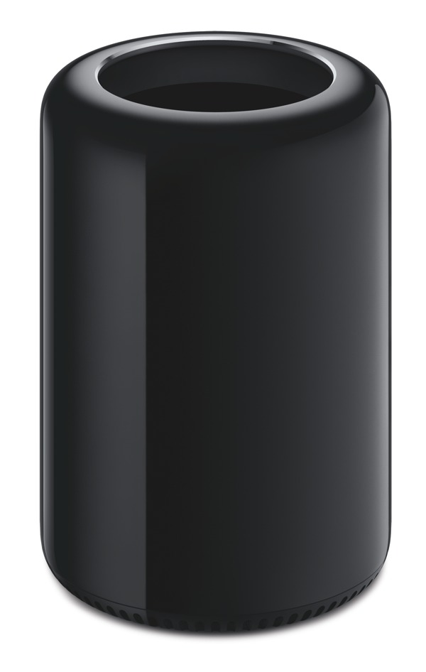

Lots of people were worried when the [new-old Mac Pro](http://www.marco.org/2012/06/11/half-assed-mac-pro) was released last June. It was an incredibly incremental update, with slightly newer CPUs and a slightly reduced price. People interpreted this as Apple abandoning the pro desktop market in favour of their prosumer models.

They couldn't have been more wrong.

> We didn't want to just make another version of the same old desktop idea that everyone's had. Like with MacBook Air, our engineering team has spent quite a bit of time thinking about the technology available today and what could be possible for the future of the pro desktop, what would be a new form factor, new design, **new capabilities for another ten years**.

The [new-new Mac Pro](http://www.apple.com/mac-pro/) embodies what Apple does best, completely rethink a product and refine it's category. This almost always leads to complaints from some users who aren't happy with the changes made. The lack of internal expansion or upgradability is the main gripe, and another is that the smaller doesn't benefit them.

Their ideal scenario would've been to keep the old Mac Pro case, and stuff it with the latest internals. But if Apple did that, it would be another sign of the demise of the Mac Pro, a sign that they didn't care. But by putting the effort into redesigning and rethinking the concept of a pro desktop computer, Apple has set the standard of the next generation desktop.

Will we see more pro desktop machines from competitors similar to the Mac Pro? I'm sure Samsung already has one in the works, but given the history of how long it took them to respond to the MacBook Air, I wouldn't hold my breath.