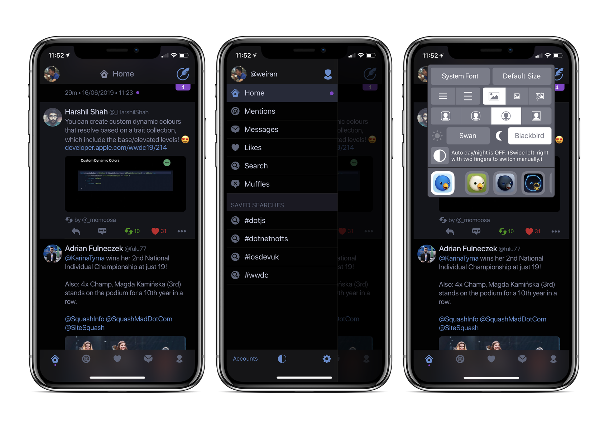

Iconfactory just released their latest update to the oldest Twitter app around: [Twitterrific](https://twitterrific.com/ios). I talked a bit about Twitterrific in [my last post](/blog/2019/5/blogging-again/), the Mac version was the first ever desktop app that used Twitter's (then undocumented) API.

## #NotMyTwitter

In recent years I've been a big [Tweetbot](https://tapbots.com/tweetbot) user, especially since they brought [Tweetbot to the Mac](https://tapbots.com/tweetbot/mac/), and in general I've been pretty happy with it. However with the coming demise of [Tweet Marker](https://www.manton.org/2019/05/15/saying-goodbye-to.html), and Tweetbot's inability to use iCloud for timeline syncing when iCloud Drive is disabled (my corporate Mac doesn't allow iCloud Drive) has had me looking at Twitter app ecosystem again.

The first thing I tried was the official Twitter app, which I still use maybe once a week to check notifications since Twitter [removed that feature from their third-party APIs](https://blog.iconfactory.com/2018/07/push-nope-ifications/). Even with a recent feature to "show your latest tweets", which just means Twitter won't fuck around with the ordering, there is no timeline syncing between the app and web, and it sometimes still randomly (actually, I'm pretty sure it's not random at all) switch back to showing what Twitter thinks are my "top tweets". I stopped using Instagram when they fucked around with my timeline, and I don't like using Twitter like this either. It's exactly like what [Dropbox has been doing](https://mjtsai.com/blog/2019/06/13/meet-the-new-dropbox/) to their product in the past week. It's a disease all venture capital funded companies seem to get; at some point the urge for growth outweighs the company's original mission, and then they alienate the users that helped make their company relevant in the first place. This is probably a topic for another blog.

What I love about Tweetbot and Twitterrific is they keep the original spirit of Twitter alive. I don't want a machine to tell me what tweets I should be looking at. They're only 280 characters max, I can read every single one on my timeline. Twitterrific 6 is a great update to an aging app, bringing it up to date with modern design trends and standards.

## Twitterrific 6

There's now finally an option to have the tabs be at the bottom rather than the top, something which I always thought was a design mistake, as it's much harder to tap at the top of an iPhone. Twitterrific also uses iCloud to sync my reading position, but unlike Tweetbot it works without iCloud Drive enabled. The enhancements to the composing popup are welcome too, now with built in Giphy support. I also like how they've customised the swipe back to dismiss gesture, so it works on all types of modal presentation even if they are presented from the bottom. Unfortunately Twitterrific for Mac hasn't been updated yet and is missing out on the new stuff, but I only really miss Giphy support, and on a Mac it isn't too much of a pain to search for them manually.

The pricing model is also quite interesting, there's a monthly subscription at 99p a month which is a great way to trial the app. If I decide I'm going to stick with it, I then have the choice of paying £9.99 a year or an outright purchase at £28.99. That may seem like a lot for an app in 2019, but I'd expect years of included updates and support just like Twitterrific 5 did, so long term it's not a bad investment compared to the yearly subscription. If you don't want to pay at all, that leaves a fairly modest and tasteful banner ad permanently at the top. I think this is easier to ignore than ads embedded in the timeline, so if it doesn't bother you then you won't need to pay at all.

I'm going to keep using Twitterrific for a few more weeks before I decide to switch to it. There's also the [revival of Twitter for Mac](https://www.macrumors.com/2019/06/14/twitter-for-mac-app-coming-soon/) using Catalyst (née Marzipan), which I'm interested in trying when it's released.